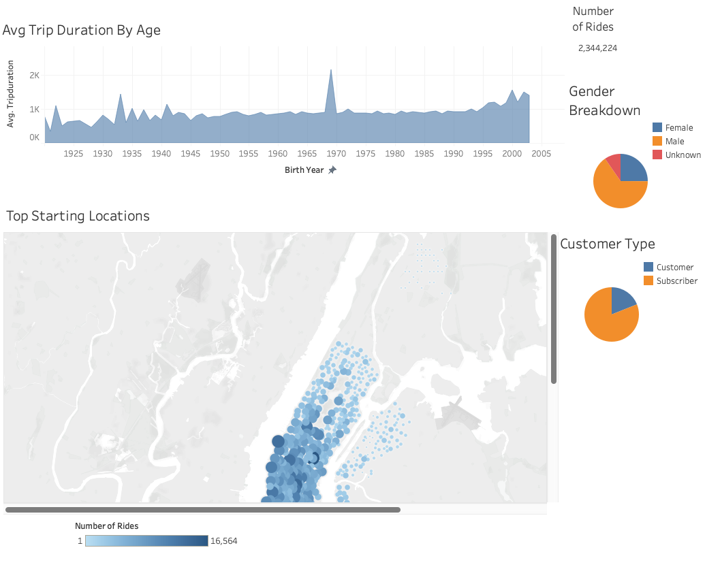
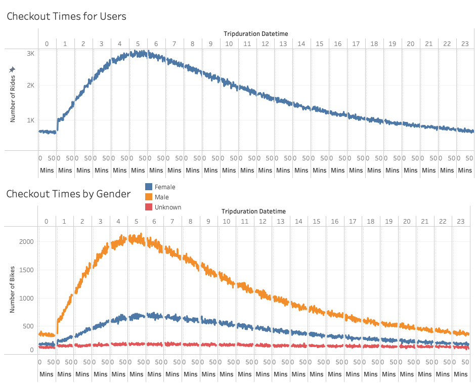
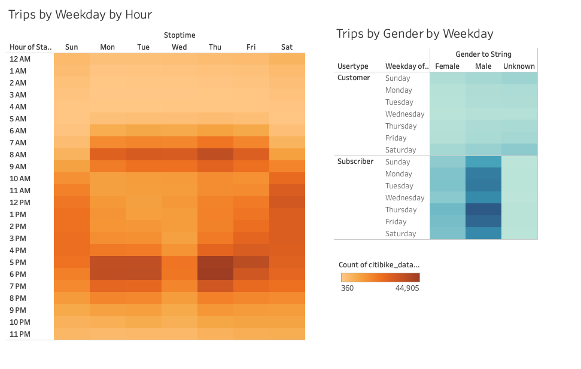
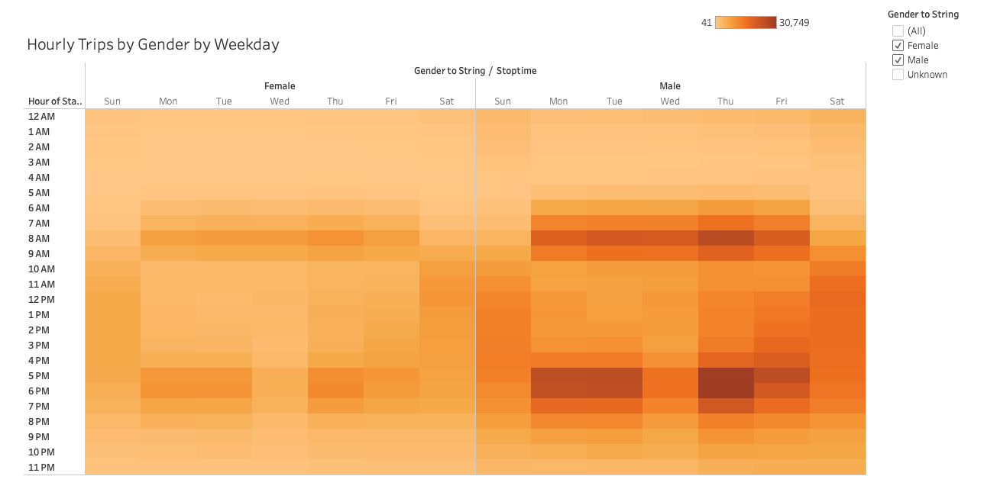

# bikesharing

## Project Overview
Using New York Citi Bike data from the month of August 2019, this project uses various data visualizations tools to analyze the viability of a bike-sharing business in Des Moines, Iowa.

## Results
### Tableau Analysis/Visualizations
[Link to Dashboard](https://public.tableau.com/views/NYCCitibikeAnalysis_16484096069200/NYCCitibikeStory?:language=en-US&publish=yes&:display_count=n&:origin=viz_share_link)

- There were over 2.3MM rides taken in August 2019 by CitiBike customers.
- Of these customers, 85% were subscribers.
- 65% of the customers were male and 25% confirmed they were female. The remaining 10% were unknown.
- The most population-dense areas were the most popular starting locations for riders, particularly in the lower half of Manhattan.

- The most popular ride durations were between 4 and 6 hours.
- Men took roughly 4x as many rides as women.

- The most popular times for rides were between 7 and 9 am, as well as from 5 to 7 pm on weekdays, likely signaling commuter times before and after work hours.
- The most popular times for rides on weekends were late morning and early afternoon, between 10 am and 3 pm, when many are off work during the day.

-These times above were accentuated by male users as they took more rides during the high-traffic times than females did.

## Summary
Judging from our analysis and visualizations, the vast majority of rides occured in Manhattan, by males, during rush hours. This tells us that this is a popular alternative to driving in population-dense areas. One way we could strengthen this analysis is by performing it in cold-weather months as well to determine if it is a viable business in the winter as well when temperatures are far more harsh. Additionally, we could break it down by weather type to see how variable the rides are for rainy and sunny days and if there is a correlation.
